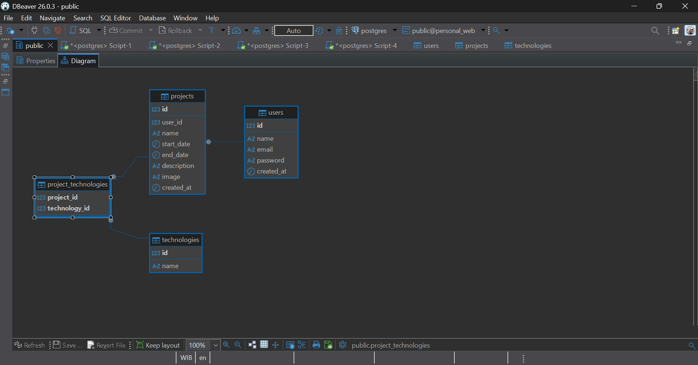

# Database Architecture - Personal Web Project

Repositori ini berisi rancangan arsitektur *database* relasional menggunakan PostgreSQL untuk Personal Web Project. Struktur ini dirancang dengan menerapkan normalisasi, *constraints* yang ketat (Primary Key, Foreign Key, UNIQUE), serta optimasi menggunakan *Indexing*.

---

## 🚀 Navigasi File
* **[Lihat Script Database (setup.sql)](setup.sql)**: Berisi seluruh perintah DDL (pembuatan tabel) dan DML (input sample data).

---

## 1. Entity Relationship Diagram (ERD)
Berikut adalah visualisasi ERD yang menunjukkan relasi antar tabel. Terdapat relasi **One-to-Many** antara `users` dan `projects`, serta relasi **Many-to-Many** antara `projects` dan `technologies` yang dijembatani oleh tabel *pivot* `project_technologies`.

---

## 2. Tipe Data dan Constraints (Properties)
Pemilihan tipe data dan penentuan *constraints* (seperti `NOT NULL`, `UNIQUE`, dan `DEFAULT CURRENT_TIMESTAMP`) diterapkan untuk menjaga integritas data (Data Integrity).

### Tabel Projects

### Tabel Projects

### Tabel Technologies

---

## 3. Hasil Input Data (DML)
Berikut adalah hasil eksekusi operasi *Insert* (DML) untuk memasukkan *sample data* awal ke dalam *database*, yang memuat informasi akun pengguna, portofolio *project*, dan *tech stack* yang digunakan.

### Data Tabel Users
Tabel ini menyimpan data autentikasi pengguna.

### Data Tabel Projects
Tabel ini menyimpan rincian portofolio *project* yang dimiliki oleh *user*.

### Data Tabel Technologies
Tabel ini menyimpan *master data* dari *tech stack* yang tersedia.
